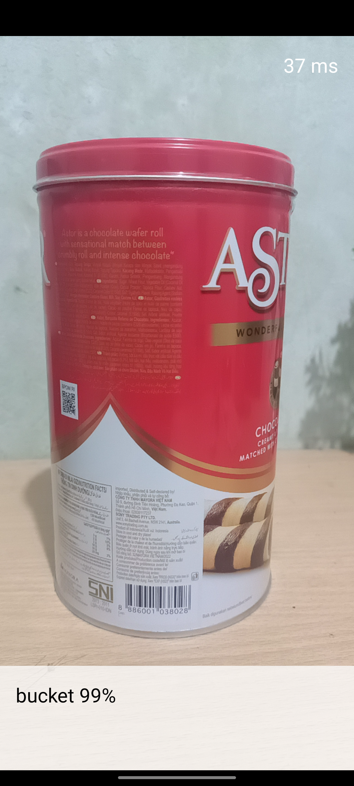

# Smart Reply using Generative AI

Create an application that can suggest answer options relevant to the ongoing conversation using the 
Smart Reply API feature from ML Kit.

| Nama Project                  | Smart Reply                    |
|-------------------------------|--------------------------------|
| Target & Minimum Target SDK   | Phone and Tablet, API level 21 |
| Tipe Activity                 | Empty Views Activity           | 
| Activity Name                 | MainActivity                   |
| Language                      | Kotlin                         |
| Build Configuration Language  | Kotlin DSL                     |

