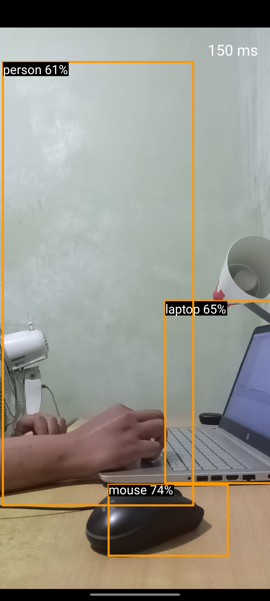

# Object Detection GPU with Tensorflow Lite

Learn how to change [Image Classification](https://github.com/kisahtegar/machine-learning-android/tree/tfl-image-classification-gpu) 
to Object Detection with Google Play Services dan GPU for Hardware Acceleration (Tensorflow Lite). 
TensorFlow Lite using GPU has performance 2-7 times faster than using CPU.

| Nama Project                  | MyCamera                       |
|-------------------------------|--------------------------------|
| Target & Minimum Target SDK   | Phone and Tablet, API level 26 |
| Tipe Activity                 | Empty Views Activity           | 
| Activity Name                 | MainActivity                   |
| Language                      | Kotlin                         |
| Build Configuration Language  | Kotlin DSL                     |

